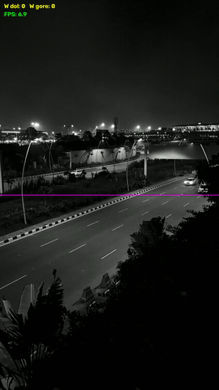

# VisionLine — Real-Time Industrial Video Analytics

System wizyjny czasu rzeczywistego do linii/strefy produkcyjnej: wykrywa obiekty,
śledzi je, zlicza i sygnalizuje problemy jakości/BHP — a zdarzenia wypycha do chmury
i (docelowo) do sterownika przemysłowego.

Projekt jest budowany **pod portfolio, CV i GitHub**, i celowo mapuje się 1:1 na
oferty pracy w obszarze *edge AI / video analytics / real-time / industrial AI*.

## Demo (Projekt 1)



*Detekcja YOLO26 + tracking ByteTrack: trwałe ID, kierunkowy licznik przekroczeń i FPS — na GPU.*

---

## Co konkretnie robi system (na przykładzie)

**Scenariusz:** kamera nad taśmą pakującą butelki.

1. Model wykrywa każdą butelkę w kadrze (detekcja YOLO26).
2. Tracker nadaje jej stały ID, żeby nie policzyć jej dwa razy (ByteTrack).
3. Gdy butelka przekroczy wirtualną linię — licznik `+1`.
4. Jeśli butelka nie ma nakrętki (druga klasa) → to jest **defekt** → zdarzenie „reject".
5. Zdarzenie leci strumieniem (Kafka) → dashboard pokazuje: sztuk/min, % braków, alarmy.
6. (Etap późniejszy) sygnał „reject" idzie do PLC → odrzut na linii.

To jest jeden przykład. Dokładnie ta sama architektura obsługuje: liczenie
ludzi/pojazdów, kontrolę kompletności montażu, albo detekcję BHP (kask/kamizelka).

---

## Dlaczego ten projekt jest dobry pod CV

Każdy klocek systemu = konkretny wymóg z Twoich ofert:

| Wymóg z oferty | Gdzie w projekcie |
|---|---|
| Computer vision, video analytics | Detekcja + tracking + zliczanie |
| NVIDIA / CUDA / TensorRT | Optymalizacja inferencji (Etap 3) |
| DeepStream | Pipeline wideo high-throughput (Etap 5) |
| Edge AI / real-time inference | Uruchomienie na GPU laptopa, potem Jetson |
| Kafka / Flink / Spark, pipeline'y streamingowe | Strumień zdarzeń + metryki (Etap 4) |
| Edge-to-cloud, event-driven | Edge liczy, chmura zbiera i wizualizuje |
| Wdrażanie modeli do produkcji, MLOps | Docker, wersjonowanie modeli, CI (Etap 3–6) |
| Integracja z systemami operacyjnymi | Rozszerzenie o PLC / czujniki (Etap 7) |

---

## Sposób pracy

- **Piszemy kod razem, krok po kroku** — Ty programujesz, ja prowadzę i tłumaczę.
- **Dokumentacja powstaje na bieżąco** w `docs/` (Markdown, wersjonowany z kodem).
- **Sprzęt:** najpierw laptop z GPU NVIDIA (Etapy 0–4), potem inwestycja w Jetson (Etap 6).
- Każdy etap kończy się **działającym, pokazywalnym rezultatem** (ważne do portfolio).

---

## Mapa dokumentów

- [`docs/01_architektura.md`](docs/01_architektura.md) — komponenty i przepływ danych.
- [`docs/02_roadmap.md`](docs/02_roadmap.md) — etapy 0–7, co robimy i co umiesz po każdym.
- [`docs/03_stack_i_narzedzia.md`](docs/03_stack_i_narzedzia.md) — technologie, wersje, dlaczego.
- [`docs/04_struktura_repo.md`](docs/04_struktura_repo.md) — układ katalogów docelowego repo.
- [`docs/05_projekt1_plan.md`](docs/05_projekt1_plan.md) — **szczegółowy plan Projektu 1** (kroki 0.1–1.6).
- [`docs/instrukcja.md`](docs/instrukcja.md) — **komendy krok po kroku** (hands-on) z wyjaśnieniami.

---

## Podejście dwufazowe

Pipeline jest agnostyczny wobec obiektu, więc budujemy go raz i przełączamy use-case:

- **Faza A (Projekt 1):** ludzie i pojazdy na gotowym YOLO26 — detekcja, tracking, zliczanie. Bez własnych danych.
- **Faza B:** obiekt przemysłowy (butelki / LEGO / `jumo devices`) z pełnym cyklem treningu.

Cały projekt jest spięty z **platformą Ultralytics** (zarządzanie modelami, anotacja,
trening w chmurze, eksport, deployment).

---

## Uruchomienie (Projekt 1)

Licznik ludzi i pojazdów w czasie rzeczywistym (YOLO26 + ByteTrack).

```bash
# 1. środowisko
python -m venv .venv
.\.venv\Scripts\Activate.ps1          # Windows
pip install ultralytics
pip install torch torchvision --index-url https://download.pytorch.org/whl/cu126

# 2. konfiguracja: ustaw źródło i klasy w src/config.py
#    pojazdy:  SOURCE = "data/highway.mp4"   CLASSES = [2, 3, 5, 7]
#    ludzie:   SOURCE = 0                     CLASSES = [0]

# 3. uruchom
python -m src.app
```

Wynik: okno z detekcją, trwałymi ID, licznikiem kierunkowym i FPS; nagranie w `runs/demo.mp4`.

## Status i dalsze kroki

Projekt 1 (Faza A) ukończony. Pełny log komend: [`docs/instrukcja.md`](docs/instrukcja.md).
Następnie **Faza B** — trening własnego modelu na platformie Ultralytics + optymalizacja
TensorRT (roadmap, Etap 2+).
